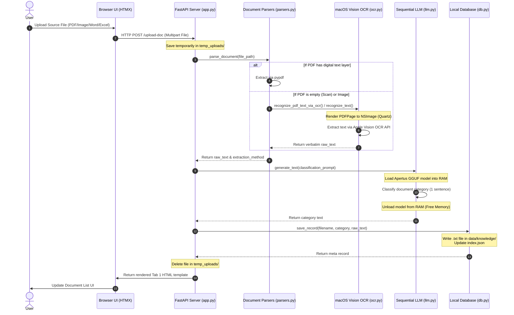
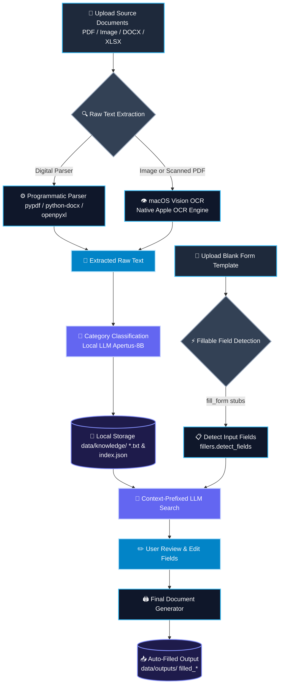

# arc43 — System Architecture & Developer Guide

This document contains the detailed system architecture, project directory structure, configuration settings, and instructions for setting up and developing **arc43** locally.

---

## 🏗️ Technical Architecture & Workflow

The application consists of two main pipelines matching the two main tabs in the user interface:

### 1. Ingestion Pipeline (Tab 1: Knowledge Base)

When a user uploads a source document (Resume, ID card, tax document, etc.):

1. **Temporary Upload**: The file is stored in `data/temp_uploads/`.
2. **Raw Text Extraction**:
   - **Image Files (`.png`, `.jpg`, `.jpeg`, `.bmp`, `.tiff`)**: Processed using the native **macOS Vision Framework** (`ocr.recognize_text`) via the PyObjC API with high accuracy (`recognitionLevel = 0` / Accurate).
   - **PDF Files (`.pdf`)**: Digital text is extracted using the `pypdf` parser. If the digital reading returns empty text `""` (indicating a scanned document or image PDF), the system triggers the **native fallback OCR** (`ocr.recognize_pdf_text_via_ocr`) which renders PDF pages in-memory using `Quartz.PDFDocument` to `NSImage` format and performs OCR using the Vision API.
   - **Word Files (`.docx`)**: Paragraph and table text is programmatically extracted using `python-docx` (with automatic deduplication for merged cells).
   - **Excel Files (`.xlsx`)**: Data rows and cell values are programmatically extracted from each worksheet using `openpyxl` (`data_only=True`).
3. **Category Classification by LLM**:
   The extracted raw text is sent to the local LLM (**Apertus-SEA-LION-v4-8B-IT** based on Qwen2.5) with a prompt to generate a **single-sentence description of the document category/type** (e.g., _"Personal data containing ID Card (Kartu Tanda Penduduk)"_).
4. **Permanent Storage**:
   - Data is stored as a plain text file `.txt` in `data/knowledge/` formatted as: Line 1 contains the category, Line 2 is empty, and Line 3+ contains the original raw text.
   - Document metadata (unique ID with timestamp, original filename, upload date, source type, extraction method, and category) is written to [data/knowledge/index.json](data/knowledge/index.json) for UI listing.
   - The temporary file in `data/temp_uploads/` is deleted.

### 2. Auto-Fill Pipeline (Tab 2: Fill Form)

The automated form-filling pipeline works as follows:

1. **Source Selection**: The user selects one or more documents from the Knowledge Base to be used as the context source.
2. **Target Form Upload**: The user uploads the blank form template they want to fill. The file is temporarily saved in `data/temp_uploads/`.
3. **Field Detection**:
   - Form fields are detected using the `fillers.detect_fields()` module. _(Note: In this baseline phase, field detection is a **mock implementation** returning three sample fields: Full Name, National ID Number (NIK), and Address)_.
4. **Contextual LLM Match**:
   - The program combines the raw text of all selected source documents, prefixing each with its document category/type as a context clue for the LLM.
   - For each detected field, the system sends a prompt to the local LLM to extract the field value verbatim from the source documents. If the data is not found, the LLM is directed to return `EMPTY`.
   - The LLM outputs are displayed in a UI table so that the user can manually review and edit them if needed.
5. **Form Writing (Form Filling & Output)**:
   - After review, the form values are sent to `fillers.fill_form()`. _(Note: In this baseline phase, form writing still outputs a simple mock text file containing key-value pairs)_.
   - The filled file is saved as `data/outputs/filled_<filename>` and the temporary file in `data/temp_uploads/` is deleted.
   - The user can download the final output file through the UI.

---

## 📊 Processing Flow Diagrams

### 1. Ingestion Flow Sequence (Tab 1)



### 2. Auto-Fill Flowchart (Tab 2)



---

## 📁 Project Directory Structure

- **`src/`**: Main source code folder.
  - [config.py](src/config.py): Project configuration settings, reading the `.env` environment file with fallbacks.
  - [db.py](src/db.py): Local database management (text files in `data/knowledge/` and `index.json`) and pipeline audit logging.
  - [ocr.py](src/ocr.py): Wrapper for macOS Vision & Quartz OCR frameworks via PyObjC.
  - [llm.py](src/llm.py): Lifecycle management of the local LLM (Apertus/SEA-LION) and embeddings (BGE-M3). Implements `SequentialLLMContext` to load the model into RAM during inference and immediately release it afterward to save memory (targeting 8GB RAM).
  - [parsers.py](src/parsers.py): Document parsers for PDF, DOCX, and XLSX with integrated fallback OCR for scanned PDFs.
  - [fillers.py](src/fillers.py): Form detection and form-filling logic (initial stage using mock/stub).
  - [app.py](src/app.py): FastAPI backend, handling web routing requests and HTMX integration.
- **`templates/`**: Jinja2 HTML templates for the user interface (premium dark theme).
  - [base.html](templates/base.html): Main layout wrapper.
  - `tab1.html`, `tab1_full.html`: Tab 1 partials and full page.
  - `tab2.html`, `tab2_full.html`: Tab 2 partials and full page.
- **`static/`**: Static UI assets.
  - `css/styles.css`: Dark theme visual styles with smooth transitions and glassmorphism.
  - `js/htmx.min.js`: HTMX library for asynchronous requests (downloaded during setup).
- **`models/`**: Folder for storing local GGUF model weight files (ignored by git).
- **`data/`**: Runtime data (ignored by git).
  - `knowledge/`: Local `.txt` database storage and `index.json`.
  - `temp_uploads/`: Directory for temporary files.
  - `outputs/`: Directory for auto-filled output documents.
  - [process_audit.log](data/process_audit.log): Step-by-step audit logs of the ingest and fill pipelines (including uploads, raw LLM prompts, LLM responses, and raw OCR output).
- **`scripts/`**: Helper scripts.
  - [download_models.py](scripts/download_models.py): Downloads local GGUF models from Hugging Face and the HTMX library for offline usage.
- **`tests/`**: Pytest unit tests.
  - [test_db.py](tests/test_db.py): Tests local database CRUD functionality.
  - [test_ocr.py](tests/test_ocr.py): Tests macOS Vision OCR module and PDF fallback handling.
  - [test_llm.py](tests/test_llm.py): Tests local LLM context initialization.

---

## ⚙️ Configuration & Environment Variables (`.env`)

The application uses a `.env` file to configure local inference behavior and model paths. You can copy the configuration template from [.env.example](.env.example):

- **`LLM_N_CTX`** (Default: `20480`): The context window size for the LLM (prompt tokens + output tokens). Qwen2.5 supports up to 32K.
- **`LLM_MAX_TOKENS`** (Default: `4096`): Output token limit generated by the LLM in a single execution.
- **`LLM_TEMPERATURE`** (Default: `0.1`): Inference creativity. A low value maintains data extraction accuracy.
- **`LLM_MODEL_FILENAME`** (Default: `apertus-sea-lion-v4-8b-it-q4_k_m.gguf`): Filename of the local LLM model inside the `models/` directory.
- **`EMBEDDING_MODEL_FILENAME`** (Default: `bge-m3-f16.gguf`): Filename of the local embedding model inside the `models/` directory.
- **`EMBEDDING_N_CTX`** (Default: `1024`): Context window size for the embedding model.
- **`OCR_RECOGNITION_LEVEL`** (Default: `0`): OCR accuracy level (0 = Accurate, 1 = Fast).

---

## 🚀 Getting Started & Running the Application

Steps to set up and run the project locally on your machine:

### 1. Synchronize Dependencies

Download and install virtual environment dependencies using `uv`:

```bash
uv sync
```

### 2. Download Local GGUF Models & Frontend Libraries

Run the downloader script to fetch the model weights (~6GB) from Hugging Face and place `htmx.min.js` in the static folder for offline usage:

```bash
uv run scripts/download_models.py
```

### 3. Run Unit Tests

Ensure all system integrations, database routines, and macOS Vision framework bindings pass verification:

```bash
uv run pytest tests/
```

### 4. Start Local FastAPI Server

Launch the web application server:

```bash
uv run uvicorn src.app:app --reload --host 127.0.0.1 --port 8000
```

Open your browser and navigate to: **[http://127.0.0.1:8000](http://127.0.0.1:8000)**.
