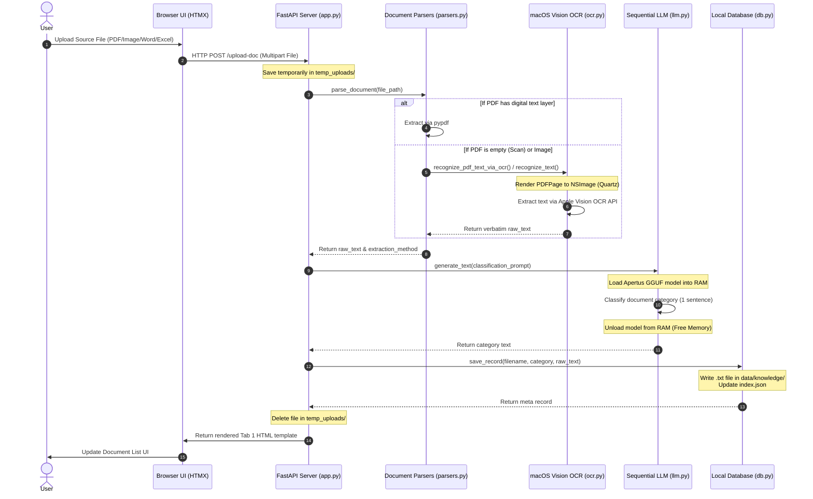
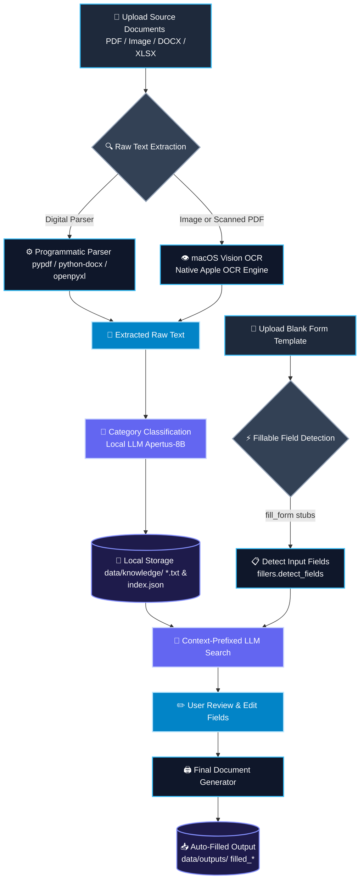

# arc43 — AI-Powered Form Auto-Fill

**arc43** is a local, privacy-first macOS application designed to automatically fill out target forms using information from your own personal documents (such as resumes, ID cards, tax forms, or spreadsheets). 

All file processing, text extraction, optical character recognition (OCR), and artificial intelligence (AI) inference are performed **100% locally on your device**. None of your personal data is ever uploaded to the cloud or sent to third-party services.

---

## 🌟 Key Features

*   **100% On-Device Privacy**: Your documents and personal data stay secure on your local machine.
*   **Multi-Format Ingestion**: Supports extracting text from PDFs, images (PNG, JPG, etc.), Word documents (DOCX), and Excel spreadsheets (XLSX).
*   **Smart Fallback OCR**: Automatically triggers macOS-native Apple Vision OCR for scanned PDFs and image files.
*   **Automated Form Matching**: Uses a local AI model to extract required form values verbatim from your personal files.
*   **Interactive Review**: Displays extracted answers in a clean table, allowing you to edit and verify before generating the final form.

---

## 💻 User Guide (How to Use)

The application features a clean, responsive web interface divided into two main tabs:

### Tab 1: Knowledge Base (Your Information Sources)

This tab is where you manage the documents that contain your personal information.

1. **Upload Source Documents**: Click the upload area to select documents such as your resume, ID documents, or transcript.
2. **Automatic Text Extraction**: The app parses the document text. If the document is an image or scan, macOS Vision OCR extracts the text.
3. **AI Classification**: A local AI model classifies the document (e.g., *"Personal information containing Resume"*).
4. **View Documents**: Your document list is saved locally and can be viewed or selected for form-filling.

### Tab 2: Auto-Fill Form (Filling Your Templates)

This tab handles the automated form-filling pipeline.

1. **Select Sources**: Check the boxes of the documents in your Knowledge Base that you want to use as references.
2. **Upload a Blank Form**: Upload the target empty form template you want to fill out.
3. **Match Fields**: The system scans the form, extracts the required field names, and queries the local AI to search your reference documents for matching answers.
4. **Review & Edit**: Review the AI-generated answers in the interactive table. You can manually edit any values if needed.
5. **Download the Filled Form**: Click "Submit" to write the values into the form. You can then download your completed document immediately.

---

## 📊 Application Workflows

Here is how data flows through the application during key operations:

### 1. Document Ingestion Flow (Tab 1)

This diagram shows how your uploaded source documents are parsed, processed by local AI, and saved to your secure offline database:

### 2. Auto-Fill Pipeline Flow (Tab 2)

This flowchart illustrates the step-by-step process of parsing templates, matching fields via local AI context, and generating the final output:

---

## 🛠️ Developer Setup & Technical details

If you are a developer, want to configure advanced environment settings (`.env`), inspect the code directory structure, or run the local test suites, please refer to the detailed technical documentation:

👉 **[System Architecture & Developer Guide (ARCHITECTURE.md)](ARCHITECTURE.md)**
