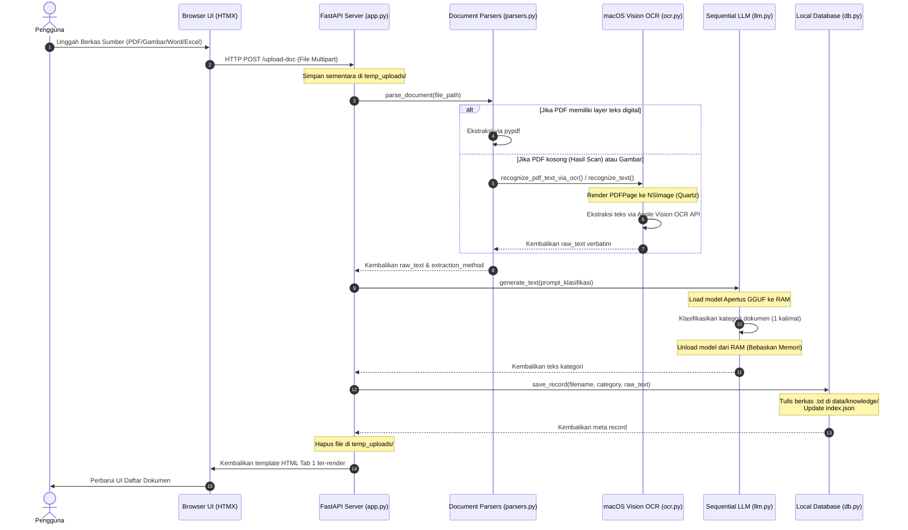

# arc43 — AI-Powered Form Auto-Fill

Project **arc43** adalah aplikasi web lokal berbasis desktop macOS yang berfungsi untuk mendeteksi kolom isian pada formulir target (template) dan mengisinya secara otomatis menggunakan data dari basis pengetahuan (Knowledge Base) dokumen pengguna. Seluruh proses pengolahan berkas, OCR, ekstraksi teks, klasifikasi, dan inferensi LLM dilakukan **100% secara lokal (on-device)** tanpa ada pengiriman data ke cloud/internet pihak ketiga.

---

## 🏗️ Arsitektur Sistem & Alur Kerja

Aplikasi terbagi menjadi dua tab antarmuka utama (Tab 1 dan Tab 2):

### 1. Tab 1: Knowledge Base (Ingest Pipeline)

Ketika pengguna mengunggah berkas dokumen (Resume, KTP, NPWP, dll.) sebagai sumber informasi:

1. **Unggah Sementara**: Berkas disimpan di `data/temp_uploads/`.
2. **Ekstraksi Teks Mentah (Raw Text Extraction)**:
   - **Berkas Gambar (`.png`, `.jpg`, `.jpeg`, `.bmp`, `.tiff`)**: Diproses menggunakan **macOS Vision Framework** native (`ocr.recognize_text`) melalui API PyObjC dengan tingkat akurasi tinggi (`recognitionLevel = 0` / Accurate).
   - **Berkas PDF (`.pdf`)**: Teks digital diekstrak menggunakan parser `pypdf`. Jika hasil pembacaan digital mengembalikan teks kosong `""` (mengindikasikan dokumen hasil scan/gambar), sistem mengaktifkan **fallback OCR native** (`ocr.recognize_pdf_text_via_ocr`) yang merender halaman PDF secara on-memory menggunakan `Quartz.PDFDocument` ke format `NSImage` dan melakukan OCR menggunakan Vision API.
   - **Berkas Word (`.docx`)**: Teks paragraf dan tabel diekstrak secara terprogram menggunakan `python-docx` (dengan deduplikasi otomatis untuk sel yang di-merge).
   - **Berkas Excel (`.xlsx`)**: Baris data dan nilai sel diekstrak secara terprogram dari setiap lembar kerja menggunakan `openpyxl` (`data_only=True`).
3. **Klasifikasi Kategori oleh LLM**:
   Teks mentah yang berhasil diekstrak dikirim ke LLM lokal (**Apertus-SEA-LION-v4-8B-IT** berbasis Qwen2.5) dengan prompt Bahasa Indonesia untuk menghasilkan **satu kalimat singkat deskripsi kategori/jenis dokumen** (contoh: _\"Data pribadi berupa KTP (Kartu Tanda Penduduk)\"_).
4. **Penyimpanan Permanen**:
   - Data disimpan sebagai file teks biasa `.txt` di `data/knowledge/` dengan format: Baris 1 berisi kategori, Baris 2 kosong, Baris 3+ berisi teks mentah asli.
   - Metadata dokumen (ID unik dengan timestamp, nama file asli, tanggal unggah, tipe sumber, metode ekstraksi, dan kategori) dicatat ke dalam [data/knowledge/index.json](data/knowledge/index.json) untuk listing UI.
   - Berkas sementara di `data/temp_uploads/` dihapus.

### 2. Tab 2: Isi Form (Auto-Fill Pipeline)

Alur pengisian formulir otomatis terdiri dari langkah berikut:

1. **Pemilihan Sumber**: Pengguna memilih satu atau beberapa dokumen dari Knowledge Base yang akan dijadikan sumber konteks data.
2. **Unggah Formulir Target**: Pengguna mengunggah berkas formulir kosong yang ingin diisi. Berkas disimpan sementara di `data/temp_uploads/`.
3. **Deteksi Kolom (Field Detection)**:
   - Kolom isian dideteksi menggunakan modul `fillers.detect_fields()`. _(Catatan: Pada fase baseline saat ini, deteksi kolom masih berupa **mock implementation** yang mengembalikan tiga kolom contoh: Nama Lengkap, NIK, dan Alamat)_.
4. **Pencarian Jawaban (Contextual LLM Match)**:
   - Program menggabungkan teks mentah dari seluruh dokumen sumber yang dipilih, lengkap dengan prefiks kategori/jenis dokumen masing-masing sebagai petunjuk konteks untuk LLM.
   - Untuk setiap kolom yang terdeteksi, sistem mengirimkan prompt ke LLM lokal untuk mengekstrak nilai kolom secara verbatim dari dokumen sumber. Jika data tidak ditemukan, LLM diarahkan mengembalikan `EMPTY`.
   - Hasil temuan LLM ditampilkan ke tabel UI agar pengguna dapat mereview dan mengeditnya secara manual jika diperlukan.
5. **Penulisan Formulir (Form Filling & Output)**:
   - Setelah direview, nilai form dikirim ke `fillers.fill_form()`. _(Catatan: Pada fase baseline saat ini, penulisan form masih menulis berkas teks mock sederhana berisi pasangan key-value)_.
   - File hasil pengisian disimpan di `data/outputs/filled_<nama_file>` dan berkas temporary di `data/temp_uploads/` dihapus.
   - Pengguna dapat mengunduh berkas hasil akhir melalui UI.

---

## 📊 Diagram Alur Pemrosesan

### 1. Diagram Sekuensial (Sequence Diagram — Alur Ingestion Tab 1)

Diagram di bawah ini menggambarkan komunikasi asinkronus dan pertukaran data maju-mundur antara komponen sistem saat pengguna mengunggah dokumen baru:



---

### 2. Diagram Aliran Blok (Top-to-Bottom Flowchart — Auto-Fill Pipeline)

Diagram di bawah menunjukkan alur data dari atas ke bawah untuk pemrosesan menyeluruh, dirancang menggunakan blok modern mengambang (efek bayangan 3D) dan silinder penyimpanan:

```mermaid
flowchart TD
    %% Node Definitions
    A[📄 Unggah Dokumen Sumber <br/> PDF / Gambar / DOCX / XLSX] --> B{🔍 Ekstraksi Teks Mentah}

    %% Format Router Decisions
    B -->|Parser Digital| C[⚙️ Parser Programmatic <br/> pypdf / python-docx / openpyxl]
    B -->|Gambar atau PDF Kosong| D[👁️ macOS Vision OCR <br/> Native Apple OCR Engine]

    C --> E[📝 Teks Mentah Hasil Ekstraksi]
    D --> E

    E --> F[🧠 Klasifikasi Kategori <br/> Local LLM Apertus-8B]
    F --> G[(💾 Penyimpanan Lokal <br/> data/knowledge/ *.txt & index.json)]

    %% Tab 2 Pipeline
    H[📄 Unggah Template Form Kosong] --> I{⚡ Deteksi Kolom Isian}
    I -->| fill_form stubs | J[📋 Deteksi Input Fields <br/> fillers.detect_fields]

    G --> K[🤖 Context-Prefixed LLM Search]
    J --> K
    K --> L[✏️ Review & Edit Kolom oleh User]
    L --> M[🖨️ Generator Dokumen Final]
    M --> N[(📥 File Hasil Auto-Fill <br/> data/outputs/ filled_*)]

    %% Styling for drop-shadow / modern 3D look
    style A fill:#1e293b,stroke:#38bdf8,stroke-width:2px,color:#fff,filter:drop-shadow(2px 4px 6px #000)
    style B fill:#334155,stroke:#94a3b8,stroke-width:2px,color:#fff,filter:drop-shadow(2px 4px 6px #000)
    style C fill:#0f172a,stroke:#38bdf8,stroke-width:2px,color:#fff,filter:drop-shadow(2px 4px 6px #000)
    style D fill:#0f172a,stroke:#38bdf8,stroke-width:2px,color:#fff,filter:drop-shadow(2px 4px 6px #000)
    style E fill:#0284c7,stroke:#bae6fd,stroke-width:2px,color:#fff,filter:drop-shadow(2px 4px 6px #000)
    style F fill:#6366f1,stroke:#c7d2fe,stroke-width:2px,color:#fff,filter:drop-shadow(2px 4px 6px #000)
    style G fill:#1e1b4b,stroke:#818cf8,stroke-width:2px,color:#fff,filter:drop-shadow(2px 4px 6px #000)
    style H fill:#1e293b,stroke:#38bdf8,stroke-width:2px,color:#fff,filter:drop-shadow(2px 4px 6px #000)
    style I fill:#334155,stroke:#94a3b8,stroke-width:2px,color:#fff,filter:drop-shadow(2px 4px 6px #000)
    style J fill:#0f172a,stroke:#38bdf8,stroke-width:2px,color:#fff,filter:drop-shadow(2px 4px 6px #000)
    style K fill:#6366f1,stroke:#c7d2fe,stroke-width:2px,color:#fff,filter:drop-shadow(2px 4px 6px #000)
    style L fill:#0284c7,stroke:#bae6fd,stroke-width:2px,color:#fff,filter:drop-shadow(2px 4px 6px #000)
    style M fill:#0f172a,stroke:#38bdf8,stroke-width:2px,color:#fff,filter:drop-shadow(2px 4px 6px #000)
    style N fill:#1e1b4b,stroke:#818cf8,stroke-width:2px,color:#fff,filter:drop-shadow(2px 4px 6px #000)
```

---

## 📁 Struktur Direktori Proyek

- **`src/`**: Folder kode sumber utama.
  - [config.py](src/config.py): Pengaturan konfigurasi proyek, membaca file lingkungan `.env` dengan fallback nilai default.
  - [db.py](src/db.py): Manajemen database lokal (file teks di `data/knowledge/` dan `index.json`) serta pencatatan audit pipeline.
  - [ocr.py](src/ocr.py): Wrapper framework OCR Vision & Quartz macOS via PyObjC.
  - [llm.py](src/llm.py): Manajemen siklus hidup LLM lokal (Apertus/SEA-LION) dan embedding (BGE-M3). Mengimplementasikan `SequentialLLMContext` untuk memuat model ke RAM saat inferensi dan langsung melepaskannya setelah selesai agar menghemat konsumsi memori (target RAM 8GB).
  - [parsers.py](src/parsers.py): Parser pembaca PDF, DOCX, XLSX, dengan fallback OCR terintegrasi untuk PDF hasil scan.
  - [fillers.py](src/fillers.py): Logika deteksi form dan pengisian form (tahap awal menggunakan mock/stub).
  - [app.py](src/app.py): Backend FastAPI, menangani request web routing dan integrasi HTMX.
- **`templates/`**: File HTML template Jinja2 untuk UI antarmuka (dark theme premium).
  - [base.html](templates/base.html): Layout utama pembungkus halaman.
  - `tab1.html`, `tab1_full.html`: Parsial dan halaman penuh Tab 1.
  - `tab2.html`, `tab2_full.html`: Parsial dan halaman penuh Tab 2.
- **`static/`**: Aset UI statis.
  - `css/styles.css`: Desain visual dark theme dengan transisi halus dan efek glassmorphism.
  - `js/htmx.min.js`: Pustaka HTMX untuk request asinkronus (diunduh saat setup).
- **`models/`**: Folder penyimpanan file bobot model GGUF lokal (diabaikan oleh git).
- **`data/`**: Runtime data (diabaikan oleh git).
  - `knowledge/`: Penyimpanan berkas `.txt` basis data dan berkas `index.json`.
  - `temp_uploads/`: Direktori penyimpanan file sementara.
  - `outputs/`: Direktori file output hasil pengisian formulir.
  - [process_audit.log](data/process_audit.log): Log audit langkah demi langkah dari pipeline ingest dan fill (upload, prompt LLM mentah, respon LLM, hasil OCR mentah).
- **`scripts/`**: Script pembantu.
  - [download_models.py](scripts/download_models.py): Mendownload model GGUF dari Hugging Face dan pustaka HTMX untuk kebutuhan offline.
- **`tests/`**: Unit testing Pytest.
  - [test_db.py](tests/test_db.py): Pengujian fungsi CRUD database lokal.
  - [test_ocr.py](tests/test_ocr.py): Pengujian modul OCR Vision macOS & penanganan fallback PDF.
  - [test_llm.py](tests/test_llm.py): Pengujian modul inisialisasi context LLM lokal.

---

## ⚙️ Konfigurasi & Variabel Lingkungan (`.env`)

Aplikasi menggunakan berkas `.env` untuk mengatur perilaku inferensi lokal dan path model. Anda dapat menyalin konfigurasi dari [.env.example](.env.example):

- **`LLM_N_CTX`** (Default: `20480`): Ukuran context window untuk LLM (token prompt + token output). Qwen2.5 mendukung hingga 32K.
- **`LLM_MAX_TOKENS`** (Default: `4096`): Batas token output yang dihasilkan LLM dalam sekali generasi.
- **`LLM_TEMPERATURE`** (Default: `0.1`): Kreativitas inferensi. Nilai rendah menjaga keakuratan ekstraksi data.
- **`LLM_MODEL_FILENAME`** (Default: `apertus-sea-lion-v4-8b-it-q4_k_m.gguf`): Nama berkas LLM lokal di folder `models/`.
- **`EMBEDDING_MODEL_FILENAME`** (Default: `bge-m3-f16.gguf`): Nama berkas embedding lokal di folder `models/`.
- **`EMBEDDING_N_CTX`** (Default: `1024`): Context window untuk model embedding.
- **`OCR_RECOGNITION_LEVEL`** (Default: `0`): Level akurasi OCR (0 = Accurate, 1 = Fast).

---

## 🚀 Panduan Memulai & Menjalankan Aplikasi

Langkah-langkah untuk menyiapkan dan menjalankan proyek di terminal lokal Anda:

### 1. Sinkronisasi Dependensi

Unduh dan pasang dependensi virtual environment menggunakan `uv`:

```bash
uv sync
```

### 2. Unduh Model GGUF Lokal & Pustaka Frontend

Jalankan script downloader untuk mengambil berkas model (~6GB) dari Hugging Face dan menaruh `htmx.min.js` secara offline ke folder statis:

```bash
uv run scripts/download_models.py
```

### 3. Jalankan Unit Testing

Pastikan semua integrasi sistem, database, dan binding macOS Vision framework lulus pengujian:

```bash
uv run pytest tests/
```

### 4. Mulai Server FastAPI lokal

Jalankan server aplikasi web:

```bash
uv run uvicorn src.app:app --reload --host 127.0.0.1 --port 8000
```

Buka browser Anda dan akses tautan: **[http://127.0.0.1:8000](http://127.0.0.1:8000)**.
