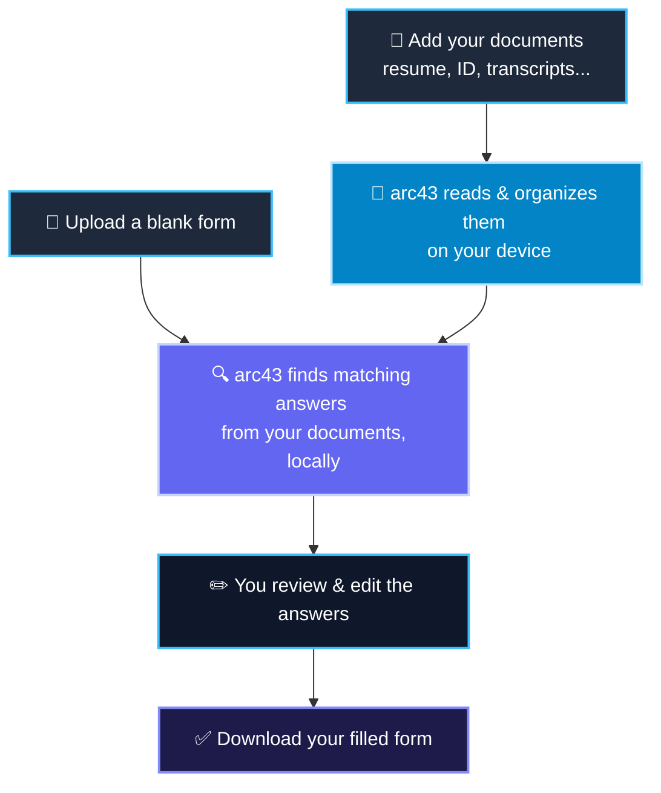

# arc43 — AI-Powered Form Auto-Fill

**arc43** is a local, privacy-first macOS application designed to automatically fill out target forms using information from your own personal documents (such as resumes, ID cards, tax forms, or spreadsheets).

All file processing, text extraction, optical character recognition (OCR), and artificial intelligence (AI) inference are performed **100% locally on your device**. None of your personal data is ever uploaded to the cloud or sent to third-party services.

---

## 🌟 Key Features

- **100% On-Device Privacy**: Your documents and personal data stay secure on your local machine.
- **Multi-Format Ingestion**: Supports extracting text from PDFs, images (PNG, JPG, etc.), Word documents (DOCX), and Excel spreadsheets (XLSX).
- **Smart Fallback OCR**: Automatically triggers macOS-native Apple Vision OCR for scanned PDFs and image files.
- **Automated Form Matching**: Uses a local AI model to extract required form values verbatim from your personal files.
- **Interactive Review**: Displays extracted answers in a clean table, allowing you to edit and verify before generating the final form.

---

## 💻 User Guide (How to Use)

The application features a clean, responsive web interface divided into two main tabs.

### Tab 1: Knowledge Base (Your Information Sources)

This is where you manage the documents that contain your personal information.

1. **Upload Source Documents** — Click the upload area to add documents such as your resume, ID, or transcript.
2. **Automatic Text Extraction** — The app reads the document. If it's an image or a scanned file, on-device OCR extracts the text for you automatically — no setup needed.
3. **AI Classification** — A local AI model labels the document for you (e.g., _"Personal information containing Resume"_), so your Knowledge Base stays organized.
4. **View Your Documents** — Everything is saved locally and stays available for future forms.

### Tab 2: Auto-Fill Form (Filling Your Templates)

This is where the magic happens — turning a blank form into a filled one.

1. **Select Sources** — Check which documents from your Knowledge Base should be used as references for this form.
2. **Upload a Blank Form** — Add the empty form template you want filled out.
3. **Automatic Matching** — arc43 scans the form's fields and searches your selected documents locally to find the right answers.
4. **Review & Edit** — Check the AI-generated answers in a simple table. Edit anything that isn't quite right.
5. **Download Your Filled Form** — Click "Submit" and download your completed document right away.

---

## 🔄 How It Works, At a Glance

Everything above happens **on your Mac** — nothing is sent to the cloud.

---

## 🛠️ Developer Setup & Technical Details

Looking for the internal architecture, sequence diagrams, environment configuration (`.env`), code directory structure, or how to run the local test suites? That's all covered in the technical documentation:

👉 **[System Architecture & Developer Guide (ARCHITECTURE.md)](ARCHITECTURE.md)**
